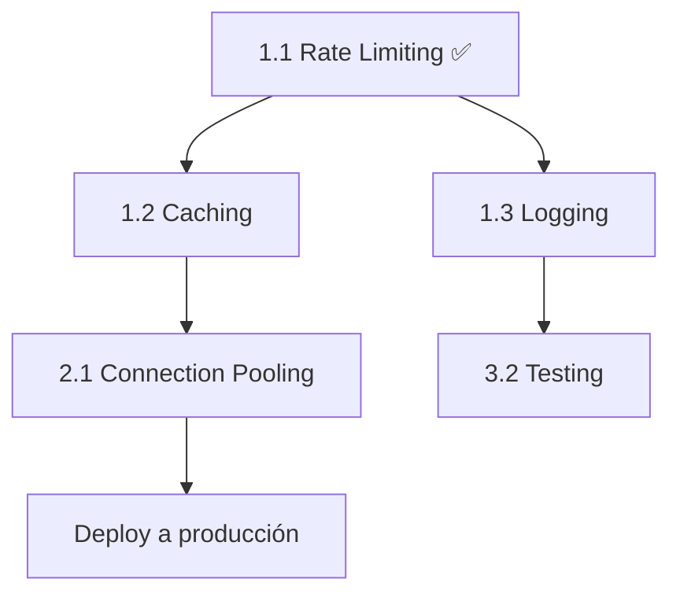

# ✅ CHECKLIST MAESTRO - Roadmap a Producción Enterprise

**Proyecto:** FinanzasCL  
**Última actualización:** 14 de Febrero, 2026  
**Progreso Global:** 🟢 1/12 tareas críticas completadas (8%)

---

## 📊 Vista General del Progreso

```
🔴 CRÍTICO (Semana 1)        ▓▓░░░░░░░░ 25%  (1/4 completado)
🟡 IMPORTANTE (Semana 2-3)   ░░░░░░░░░░  0%  (0/4 completado)  
🟢 MEJORAS FUTURAS (Mes 2)   ░░░░░░░░░░  0%  (0/4 completado)

TOTAL: ████░░░░░░░░░░░░░░░░ 8% (1/12)
```

---

## 🔴 FASE 1: CRÍTICO (Semana 1) - Seguridad & Performance

### ✅ 1.1 Rate Limiting (COMPLETADO)
**Prioridad:** 🔴 CRÍTICA  
**Tiempo estimado:** 2h  
**Tiempo real:** 1.5h  
**Estado:** ✅ COMPLETADO Y VERIFICADO

**Tareas:**
- [x] Instalar dependencias (`@upstash/ratelimit`, `@upstash/redis`)
- [x] Crear cuenta en Upstash
- [x] Configurar credenciales en `.env`
- [x] Crear `lib/rate-limit.ts`
- [x] Aplicar en `app/api/chat/route.ts`
- [x] Verificar funcionamiento (Dashboard Upstash muestra claves)

**Archivos creados:**
- ✅ `lib/rate-limit.ts`
- ✅ `docs/02-seguridad-ratelimiting/CONFIGURAR-UPSTASH.md`
- ✅ `docs/02-seguridad-ratelimiting/RESUMEN-IMPLEMENTACION.md`

**Archivos modificados:**
- ✅ `app/api/chat/route.ts` (líneas 1-63)
- ✅ `.env` (agregadas vars UPSTASH)

**Beneficios obtenidos:**
- ✅ Protección contra abusos (10 msgs/min por usuario)
- ✅ Costos OpenAI controlados
- ✅ Headers informativos (X-RateLimit-*)
- ✅ Analytics en dashboard

**Documentación:** Ver `docs/02-seguridad-ratelimiting/`

---

### 🔲 1.2 Caching de Datos
**Prioridad:** 🔴 CRÍTICA  
**Tiempo estimado:** 4h  
**Estado:** ⏳ PENDIENTE

**Objetivo:** Reducir latencia de 800ms → 80ms (10x mejora)

**Tareas:**
- [ ] Crear `lib/cache.ts` (funciones getCached, setCached, invalidateCache)
- [ ] Modificar `lib/services/finance.service.ts`:
  - [ ] `getDashboardData()` - Agregar cache de 30 segundos
  - [ ] `getMovimientos()` - Agregar cache de 30 segundos
- [ ] Invalidar cache en mutaciones:
  - [ ] `createMovimiento()` - Invalidar al crear
  - [ ] `updateMovimiento()` - Invalidar al editar
  - [ ] `deleteMovimiento()` - Invalidar al eliminar
- [ ] Test: Medir latencia antes/después (objetivo: <100ms)
- [ ] Documentar en `docs/02-seguridad-ratelimiting/IMPLEMENTAR-CACHE.md`

**Archivos a crear:**
- `lib/cache.ts`
- `docs/02-seguridad-ratelimiting/IMPLEMENTAR-CACHE.md`

**Archivos a modificar:**
- `lib/services/finance.service.ts` (funciones: getDashboardData, getMovimientos, create/update/delete)

**Dependencias:**
- ✅ Upstash Redis configurado (ya está)

**Métricas esperadas:**
- Latencia promedio: 800ms → 80ms
- Cache hit rate: >70%
- Reducción queries BD: 80%

**Documentación de referencia:** `docs/01-auditoria/AUDITORIA-TECNICA-ENTERPRISE.md` (sección 1.2.A)

---

### 🔲 1.3 Logging Estructurado
**Prioridad:** 🔴 CRÍTICA  
**Tiempo estimado:** 3h  
**Estado:** ⏳ PENDIENTE

**Objetivo:** Reemplazar `console.log` con sistema profesional de logs

**Tareas:**
- [ ] Instalar Pino: `npm install pino pino-pretty`
- [ ] Crear `lib/logger.ts` (logger base + helpers)
- [ ] Crear `lib/logger-chat.ts` (helpers específicos para chat)
- [ ] Reemplazar logs en `app/api/chat/route.ts`:
  - [ ] Línea 80-82: console.log → logger.info
  - [ ] Línea 112-113: console.log → logChatEvent("router")
  - [ ] Línea 122, 137, 146, 170: console.log → logChatEvent("executor")
  - [ ] Línea 187: console.log → logChatEvent("generator")
  - [ ] Línea 209: console.error → logger.error
- [ ] (Opcional) Configurar Axiom/Datadog para producción
- [ ] Documentar en `docs/02-seguridad-ratelimiting/LOGGING.md`

**Archivos a crear:**
- `lib/logger.ts`
- `lib/logger-chat.ts`
- `docs/02-seguridad-ratelimiting/LOGGING.md`

**Archivos a modificar:**
- `app/api/chat/route.ts` (reemplazar ~10 console.log)

**Estructura de logs propuesta:**
```json
{
  "level": "info",
  "event": "chat:request",
  "userId": "user_123",
  "messageCount": 5,
  "timestamp": "2026-02-14T03:00:00.000Z"
}
```

**Documentación de referencia:** `docs/01-auditoria/AUDITORIA-TECNICA-ENTERPRISE.md` (sección 1.3.A)

---

### 🔲 1.4 Índices de Base de Datos
**Prioridad:** 🔴 CRÍTICA  
**Tiempo estimado:** 1h  
**Estado:** ⏳ PENDIENTE

**Objetivo:** Queries instantáneas (<100ms) con 10,000+ registros

**Tareas:**
- [ ] Modificar `prisma/schema.prisma` - Modelo `Movimiento`:
  - [ ] Agregar índice compuesto: `[userId, fecha]` (orden descendente)
  - [ ] Agregar índice compuesto: `[userId, categoriaId, fecha]`
  - [ ] Agregar índice compuesto: `[userId, tipoMovimiento, fecha]`
  - [ ] Eliminar índices simples redundantes
- [ ] Ejecutar migración: `npx prisma migrate dev --name add_composite_indexes`
- [ ] Ejecutar: `npx prisma generate`
- [ ] Verificar en Supabase Dashboard (SQL query para ver índices)
- [ ] Test de performance: Query con filtros complejos
- [ ] Documentar en `docs/03-setup-inicial/INDICES-BD.md`

**Archivos a modificar:**
- `prisma/schema.prisma` (modelo Movimiento, líneas 172-203)

**Archivos a crear:**
- `prisma/migrations/YYYYMMDDHHMMSS_add_composite_indexes/migration.sql`
- `docs/03-setup-inicial/INDICES-BD.md`

**Comandos a ejecutar:**
```bash
npx prisma migrate dev --name add_composite_indexes
npx prisma generate
```

**Query de verificación (Supabase):**
```sql
SELECT indexname, indexdef 
FROM pg_indexes 
WHERE tablename = 'Movimiento' 
ORDER BY indexname;
```

**Documentación de referencia:** `docs/01-auditoria/AUDITORIA-TECNICA-ENTERPRISE.md` (sección 2.1.A)

---

## 🟡 FASE 2: IMPORTANTE (Semana 2-3) - UX & Escalabilidad

### 🔲 2.1 Connection Pooling
**Prioridad:** 🟡 ALTA  
**Tiempo estimado:** 3h  
**Estado:** ⏳ PENDIENTE

**Objetivo:** Eliminar errores "Too many connections" en producción

**Opciones disponibles:**
- **Opción A:** Prisma Accelerate ($29/mes, más simple)
- **Opción B:** PgBouncer (gratis, ya incluido en Supabase)

**Tareas (Opción B - PgBouncer):**
- [ ] Verificar `DATABASE_URL` usa puerto 6543 (PgBouncer)
- [ ] Agregar parámetros: `?pgbouncer=true&connection_limit=5`
- [ ] Modificar `prisma/schema.prisma`:
  - [ ] Verificar `directUrl` para migraciones
- [ ] Refactorizar transacciones interactivas a batch:
  - [ ] `lib/services/finance.service.ts` (si aplica)
- [ ] Test de carga: 100 requests concurrentes
- [ ] Documentar en `docs/03-setup-inicial/CONNECTION-POOLING.md`

**Archivos a modificar:**
- `.env` (DATABASE_URL)
- `prisma/schema.prisma` (verificar directUrl)
- `lib/services/finance.service.ts` (transacciones, si aplica)

**Archivos a crear:**
- `docs/03-setup-inicial/CONNECTION-POOLING.md`

**Test de verificación:**
```bash
# Simular carga con Artillery o similar
artillery quick --count 100 --num 10 http://localhost:3000/api/chat
```

**Documentación de referencia:** `docs/01-auditoria/AUDITORIA-TECNICA-ENTERPRISE.md` (sección 2.2.A)

---

### 🔲 2.2 Persistencia del Chat (Zustand)
**Prioridad:** 🟡 ALTA  
**Tiempo estimado:** 6h  
**Estado:** ⏳ PENDIENTE

**Objetivo:** Usuario no pierde conversación al cambiar de página

**Tareas:**
- [ ] Instalar: `npm install zustand`
- [ ] Crear `lib/stores/chat-store.ts`:
  - [ ] Store con persist middleware
  - [ ] Funciones: setMessages, addMessage, clearMessages
- [ ] Modificar `components/ai-assistant.tsx`:
  - [ ] Import useChatStore
  - [ ] Restaurar mensajes desde localStorage
  - [ ] Sincronizar con useChat
  - [ ] Agregar botón "Limpiar historial"
- [ ] Test: Cambiar de página y volver (historial debe persistir)
- [ ] Documentar en `docs/04-guias-futuras/PERSISTENCIA-CHAT.md`

**Archivos a crear:**
- `lib/stores/chat-store.ts`
- `docs/04-guias-futuras/PERSISTENCIA-CHAT.md`

**Archivos a modificar:**
- `components/ai-assistant.tsx` (agregar ~30 líneas)

**Documentación de referencia:** `docs/01-auditoria/AUDITORIA-TECNICA-ENTERPRISE.md` (sección 3.1.A)

---

### 🔲 2.3 UX Móvil (Bottom Sheet)
**Prioridad:** 🟡 MEDIA  
**Tiempo estimado:** 8h  
**Estado:** ⏳ PENDIENTE

**Objetivo:** Chat no tapa contenido en móviles

**Tareas:**
- [ ] Instalar: `npx shadcn@latest add drawer`
- [ ] Crear `components/ai-assistant-mobile.tsx`:
  - [ ] Usar Drawer de Shadcn
  - [ ] Bottom sheet que ocupa 85vh
  - [ ] Safe area padding para iOS
- [ ] Modificar `app/layout.tsx`:
  - [ ] Desktop: Usar AiAssistant original
  - [ ] Mobile: Usar AiAssistantMobile
  - [ ] Media query: `md:block` / `md:hidden`
- [ ] Test: Abrir en móvil real (iPhone y Android)
- [ ] Documentar en `docs/04-guias-futuras/UX-MOVIL.md`

**Archivos a crear:**
- `components/ai-assistant-mobile.tsx`
- `docs/04-guias-futuras/UX-MOVIL.md`

**Archivos a modificar:**
- `app/layout.tsx` (agregar renderizado condicional)

**Componentes Shadcn necesarios:**
- Drawer (Bottom Sheet)

**Documentación de referencia:** `docs/01-auditoria/AUDITORIA-TECNICA-ENTERPRISE.md` (sección 3.2.A)

---

### 🔲 2.4 Autenticación API Móvil (JWT)
**Prioridad:** 🟡 ALTA  
**Tiempo estimado:** 8h  
**Estado:** ⏳ PENDIENTE

**Objetivo:** API REST segura para app móvil

**Tareas:**
- [ ] Crear `lib/auth-api.ts`:
  - [ ] Función authenticateAPIRequest()
  - [ ] Soportar cookies (web) y Bearer token (móvil)
- [ ] Crear `app/api/auth/mobile/login/route.ts`:
  - [ ] Endpoint de login
  - [ ] Verificar contraseña con bcrypt
  - [ ] Generar JWT con jsonwebtoken
- [ ] Modificar todos los endpoints de API:
  - [ ] `app/api/v1/movimientos/route.ts`
  - [ ] `app/api/v1/cuentas/route.ts`
  - [ ] `app/api/v1/categorias/route.ts`
  - [ ] Reemplazar getUserIdFromRequest()
- [ ] Test: Login desde Postman con Bearer token
- [ ] Documentar en `docs/04-guias-futuras/AUTH-MOVIL.md`

**Archivos a crear:**
- `lib/auth-api.ts`
- `app/api/auth/mobile/login/route.ts`
- `docs/04-guias-futuras/AUTH-MOVIL.md`

**Archivos a modificar:**
- `app/api/v1/movimientos/route.ts`
- `app/api/v1/cuentas/route.ts`
- `app/api/v1/categorias/route.ts`

**Dependencias:**
- jsonwebtoken (ya incluido en next-auth)

**Test con curl:**
```bash
# 1. Login
curl -X POST http://localhost:3000/api/auth/mobile/login \
  -H "Content-Type: application/json" \
  -d '{"email":"test@test.com","password":"password123"}'

# 2. Usar token
curl http://localhost:3000/api/v1/movimientos \
  -H "Authorization: Bearer eyJhbGc..."
```

**Documentación de referencia:** `docs/01-auditoria/AUDITORIA-TECNICA-ENTERPRISE.md` (sección 3.3.A)

---

## 🟢 FASE 3: MEJORAS FUTURAS (Mes 2) - Calidad & Testing

### 🔲 3.1 Type Safety & Type Guards
**Prioridad:** 🟢 MEDIA  
**Tiempo estimado:** 3h  
**Estado:** ⏳ PENDIENTE

**Objetivo:** Eliminar `any` y castings peligrosos

**Tareas:**
- [ ] Crear `lib/types/chat.ts`:
  - [ ] Type guard: isUIMessage()
  - [ ] Type guard: isUIMessageArray()
  - [ ] Helper: getLastUserMessage()
- [ ] Modificar `app/api/chat/route.ts`:
  - [ ] Reemplazar función getLastUserMessageContent()
  - [ ] Usar type guards estrictos
  - [ ] Eliminar castings con `as`
- [ ] Agregar validación de tipos en entrada
- [ ] Documentar en `docs/04-guias-futuras/TYPE-SAFETY.md`

**Archivos a crear:**
- `lib/types/chat.ts`
- `docs/04-guias-futuras/TYPE-SAFETY.md`

**Archivos a modificar:**
- `app/api/chat/route.ts` (líneas 18-54)

**Documentación de referencia:** `docs/01-auditoria/AUDITORIA-TECNICA-ENTERPRISE.md` (sección 4.1.A)

---

### 🔲 3.2 Testing Automatizado (Vitest)
**Prioridad:** 🟢 MEDIA  
**Tiempo estimado:** 12h  
**Estado:** ⏳ PENDIENTE

**Objetivo:** Cobertura >70% en código crítico

**Tareas:**
- [ ] Instalar dependencias: `npm install --save-dev vitest @testing-library/react @testing-library/jest-dom @vitest/ui`
- [ ] Crear `vitest.config.ts`
- [ ] Crear `vitest.setup.ts`
- [ ] Tests unitarios del Router:
  - [ ] `tests/unit/chat-router.test.ts` (3 tests)
  - [ ] Test: Clasificar "balance" como BALANCE
  - [ ] Test: Clasificar "gastos en comida" como MOVIMIENTOS
  - [ ] Test: Extraer fechas de "gastos de enero"
- [ ] Tests de integración del Executor:
  - [ ] `tests/integration/chat-executor.test.ts` (3 tests)
  - [ ] Test: getMovimientos retorna datos correctos
  - [ ] Test: Filtrar por categoría funciona
  - [ ] Test: getDashboardData calcula balance
- [ ] Test E2E:
  - [ ] `tests/e2e/chat-flow.test.ts` (1 test)
  - [ ] Test: Flujo completo de mensaje
- [ ] Configurar scripts en `package.json`
- [ ] Documentar en `docs/04-guias-futuras/TESTING.md`

**Archivos a crear:**
- `vitest.config.ts`
- `vitest.setup.ts`
- `tests/unit/chat-router.test.ts`
- `tests/integration/chat-executor.test.ts`
- `tests/e2e/chat-flow.test.ts`
- `docs/04-guias-futuras/TESTING.md`

**Archivos a modificar:**
- `package.json` (agregar scripts de test)

**Scripts a agregar:**
```json
{
  "scripts": {
    "test": "vitest",
    "test:ui": "vitest --ui",
    "test:coverage": "vitest --coverage"
  }
}
```

**Documentación de referencia:** `docs/01-auditoria/AUDITORIA-TECNICA-ENTERPRISE.md` (sección 4.2.A)

---

### 🔲 3.3 Refactorización Modular
**Prioridad:** 🟢 BAJA  
**Tiempo estimado:** 4h  
**Estado:** ⏳ PENDIENTE

**Objetivo:** route.ts de 220 → 60 líneas

**Tareas:**
- [ ] Crear `lib/agents/router.ts`:
  - [ ] Mover clasificación de intenciones
  - [ ] Export: classifyIntent(message) → Intent
- [ ] Crear `lib/agents/executor.ts`:
  - [ ] Mover lógica de ejecución
  - [ ] Export: executeIntent(userId, intent) → ExecutorResult
- [ ] Crear `lib/agents/generator.ts`:
  - [ ] Mover generación de respuesta
  - [ ] Export: generateResponse(messages, context) → Stream
- [ ] Simplificar `app/api/chat/route.ts`:
  - [ ] Imports de módulos
  - [ ] Pipeline: router → executor → generator
- [ ] Documentar en `docs/04-guias-futuras/REFACTORIZACION.md`

**Archivos a crear:**
- `lib/agents/router.ts`
- `lib/agents/executor.ts`
- `lib/agents/generator.ts`
- `docs/04-guias-futuras/REFACTORIZACION.md`

**Archivos a modificar:**
- `app/api/chat/route.ts` (reducir de 220 a ~60 líneas)

**Estructura de carpetas:**
```
lib/
├── agents/
│   ├── router.ts (40 líneas)
│   ├── executor.ts (100 líneas)
│   └── generator.ts (30 líneas)
```

**Documentación de referencia:** `docs/01-auditoria/AUDITORIA-TECNICA-ENTERPRISE.md` (sección "Refactorización Sugerida")

---

### 🔲 3.4 Telemetría & Analytics
**Prioridad:** 🟢 BAJA  
**Tiempo estimado:** 6h  
**Estado:** ⏳ PENDIENTE

**Objetivo:** Entender cómo usan el chatbot los usuarios

**Tareas:**
- [ ] Elegir herramienta: Posthog o Mixpanel
- [ ] Instalar SDK: `npm install posthog-js`
- [ ] Crear `lib/analytics.ts`:
  - [ ] Función trackChatMessage()
  - [ ] Función trackIntentClassified()
- [ ] Agregar tracking en `app/api/chat/route.ts`:
  - [ ] Track mensaje enviado
  - [ ] Track intención detectada
  - [ ] Track tiempo de respuesta
- [ ] Dashboard en Posthog:
  - [ ] Intent distribution (BALANCE vs MOVIMIENTOS)
  - [ ] Latencia promedio por intent
  - [ ] Tasa de error
- [ ] Documentar en `docs/04-guias-futuras/ANALYTICS.md`

**Archivos a crear:**
- `lib/analytics.ts`
- `docs/04-guias-futuras/ANALYTICS.md`

**Archivos a modificar:**
- `app/api/chat/route.ts` (agregar tracking)

**Métricas a trackear:**
- Mensajes por usuario
- Intenciones más comunes
- Latencia promedio
- Tasa de error

**Documentación de referencia:** `docs/01-auditoria/AUDITORIA-TECNICA-ENTERPRISE.md` (punto 12)

---

## 📊 Métricas de Éxito

### KPIs Actuales vs Objetivos

| Métrica | Antes (MVP) | Objetivo | Actual | Estado |
|---------|-------------|----------|--------|--------|
| **Latencia promedio** | 800ms | 80ms | 800ms | ⏳ Pendiente cache |
| **Costo OpenAI/mes** | $50+ (sin límites) | $20-30 | $20-30 | ✅ Rate limit activo |
| **Bugs trackeados** | 0% | 100% | 0% | ⏳ Pendiente logging |
| **Errores "Too many conn"** | 5-10/día | 0 | Desconocido | ⏳ Pendiente pooling |
| **UX Móvil** | 3/10 | 9/10 | 3/10 | ⏳ Pendiente bottom sheet |
| **Cobertura tests** | 0% | >70% | 0% | ⏳ Pendiente Vitest |
| **Rate limiting** | ❌ Sin protección | ✅ 10/min | ✅ 10/min | ✅ ACTIVO |

---

## 🎯 Plan de Acción Recomendado

### Esta Semana (14-21 Feb)
1. ✅ Rate Limiting (COMPLETADO)
2. 🔲 Caching (4h) - **SIGUIENTE**
3. 🔲 Logging (3h)
4. 🔲 Índices BD (1h)

**Objetivo:** Completar FASE 1 (Crítico)

### Próximas 2 Semanas (22 Feb - 7 Mar)
5. 🔲 Connection Pooling (3h)
6. 🔲 Persistencia Chat (6h)
7. 🔲 UX Móvil (8h)
8. 🔲 Auth API Móvil (8h)

**Objetivo:** Completar FASE 2 (Importante)

### Mes 2 (Mar 8 - Abr 7)
9. 🔲 Type Safety (3h)
10. 🔲 Testing (12h)
11. 🔲 Refactorización (4h)
12. 🔲 Analytics (6h)

**Objetivo:** Completar FASE 3 (Mejoras)

---

## 📚 Referencias

- **Auditoría completa:** `docs/01-auditoria/AUDITORIA-TECNICA-ENTERPRISE.md`
- **Configuración Upstash:** `docs/02-seguridad-ratelimiting/CONFIGURAR-UPSTASH.md`
- **Setup inicial:** `docs/03-setup-inicial/`
- **Guías futuras:** `docs/04-guias-futuras/`

---

## 💡 Notas

### Dependencias entre Tareas



### Costos Mensuales Estimados

| Servicio | Plan | Costo |
|----------|------|-------|
| Upstash Redis | Free → Paid | $0-10/mes |
| Prisma Accelerate | Opcional | $29/mes |
| Axiom Logs | Opcional | $25/mes |
| Posthog | Free tier | $0/mes |
| **TOTAL** | | **$0-64/mes** |

---

**🎯 Siguiente tarea recomendada:** Implementar Caching (1.2) - 4 horas, 10x mejora en latencia

**⏱️ Tiempo total estimado restante:** ~58 horas (~2 semanas full-time)

---

*Checklist actualizado automáticamente. Última modificación: 14 Feb 2026, 00:30 CLT*
